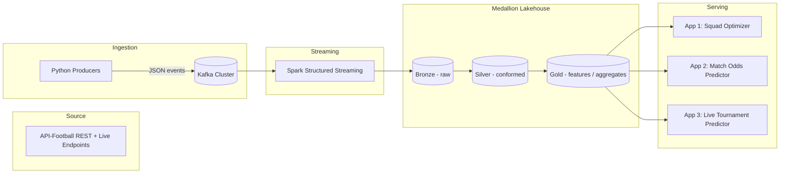

# FIFA / Football Real-Time Stats Pipeline

A hands-on, end-to-end data engineering project: ingest live football data from a
public API via **Kafka**, process it in real time with **Spark Structured
Streaming**, land it in a **Medallion (Bronze/Silver/Gold) lakehouse**, and serve
three AI-powered apps on top of it.

This repo doubles as a public build-log: weekly LinkedIn updates + Medium
write-ups track progress phase by phase.

## The three apps

| # | App | What it does |
|---|---|---|
| 1 | **Squad Optimizer** | Given a player pool/budget and formation constraints, recommends a starting XI that maximizes predicted win probability for an upcoming match. |
| 2 | **Match Odds Predictor** | Pick two teams -> get win/draw/loss probabilities based on historical form, head-to-head, ELO ratings, and player-level stats. |
| 3 | **Live Tournament Predictor** | Real-time tournament outcome simulation (e.g. group-stage qualification odds, knockout bracket win probabilities) that updates as live results stream in. |

See [`docs/apps/`](docs/apps/) for the design of each.

## Architecture



Full write-up: [`docs/architecture.md`](docs/architecture.md)

## Repo structure

```
fifa-stats-streaming/
├── docs/                # Architecture, roadmap, data source notes, app specs
├── infra/               # Local dev stack (Kafka, MinIO, etc.) via docker-compose
├── ingestion/           # Kafka topic config + Python producers (API-Football)
├── streaming/           # Spark Structured Streaming jobs (bronze -> silver -> gold)
├── medallion/           # Lakehouse table schemas/contracts per layer
├── ml/                  # Feature engineering + models for the 3 apps
└── notebooks/           # Exploration / EDA notebooks
```

## Tech stack

- **Ingestion**: Python, `kafka-python` / `confluent-kafka`, API-Football (RapidAPI)
- **Streaming**: Apache Kafka (KRaft mode), Spark Structured Streaming
- **Storage**: Delta Lake / Apache Iceberg on MinIO (S3-compatible) for local dev
- **ML**: scikit-learn / XGBoost for odds & feature models, PuLP/OR-Tools for squad
  optimization, Monte Carlo simulation for tournament predictions
- **Orchestration (later phase)**: Airflow for batch jobs (gold aggregates, model
  retraining)

## Roadmap

See [`docs/roadmap.md`](docs/roadmap.md) for the phased build plan (ingestion ->
streaming -> medallion -> 3 apps -> write-ups).

## Getting started

```bash
# 1. Start local infra (Kafka + MinIO)
cd infra && docker compose up -d

# 2. Create Kafka topics
cd ingestion/kafka && ./create_topics.sh

# 3. Configure API-Football credentials
cp ingestion/config/settings.example.yaml ingestion/config/settings.yaml
# edit settings.yaml with your RAPIDAPI_KEY (free tier: https://www.api-football.com/)

# 4. Run a producer
python -m ingestion.producers.fixtures_producer
```

## Status

🚧 Phase 0 — repo scaffold. See [`docs/roadmap.md`](docs/roadmap.md) for what's next.
