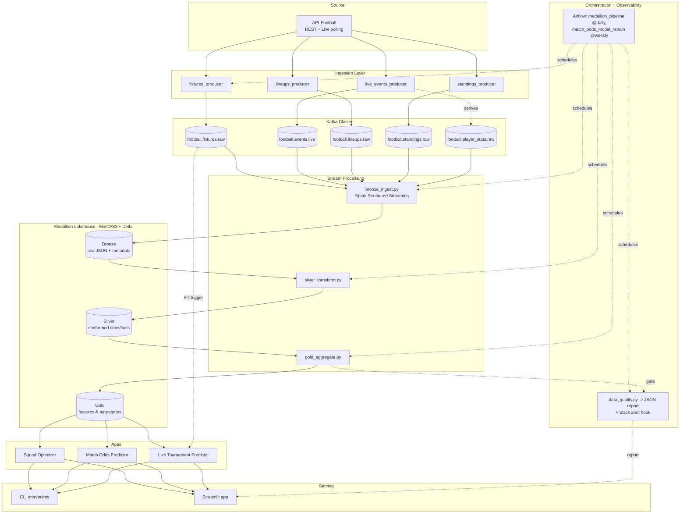

# Architecture

## Overview

## Layer-by-layer

### 1. Ingestion (Kafka producers)

Python producers poll API-Football on a schedule (respecting free-tier rate
limits) and publish raw JSON payloads to Kafka topics, one topic per logical
entity. See [`ingestion/`](../ingestion) and [Kafka topic design](../ingestion/kafka/topics.md).

- **Producer cadence**:
  - Fixtures/lineups/standings: every 15-30 min (low churn)
  - Live events: every 15-60 sec while a tracked fixture is `LIVE`
- **Reliability**: idempotent producer config (`enable.idempotence=true`),
  `acks=all`, retries with backoff. Each message carries a `source_request_id`
  and `ingest_ts` for traceability.

### 2. Stream processing (Spark Structured Streaming)

Three chained streaming/batch jobs, one per medallion hop:

- **`bronze_ingest.py`**: reads from Kafka, writes raw JSON (as strings) +
  Kafka metadata (topic, partition, offset, timestamp) to Bronze Delta tables.
  No transformation — append-only, replayable.
- **`silver_transform.py`**: reads Bronze, parses JSON against explicit
  schemas, deduplicates (by natural key + `ingest_ts`), conforms to dimension
  / fact tables (`dim_team`, `dim_player`, `dim_league`, `fact_match`,
  `fact_match_event`, `fact_player_match_stat`, `fact_standings_snapshot`).
- **`gold_aggregate.py`**: reads Silver, computes rolling-window features
  (team form, ELO ratings, head-to-head records, player season stats) used
  directly by the ML apps.

### 3. Medallion lakehouse

Storage: Delta Lake tables on MinIO (S3-compatible) for local dev — swappable
for real S3/ADLS in a cloud deployment. Table contracts documented in
[`medallion/README.md`](../medallion/README.md).

### 4. Serving / Apps

- **App 2 — Match Odds Predictor**: calibrated classifier trained on Gold
  features (`elo_diff`, rolling form), CLI (`ml/match_odds/src/predict.py`)
  and a Streamlit page on top of the same `get_match_probabilities()` core.
- **App 1 — Squad Optimizer**: a constraint solver (PuLP, formation/budget)
  picks the best XI from a scored player pool, then reuses App 2's
  win-probability function to compare it against a naive baseline lineup.
- **App 3 — Live Tournament Predictor**: Monte Carlo simulation built on App
  2's model. `live_consumer.py` watches `football.fixtures.raw` (the only
  topic carrying match status) for a tracked fixture's transition into `FT`
  and re-triggers the simulation on that event; the Streamlit page exposes
  the same record-result-and-resimulate path via a form, for demoing the
  live-trigger effect without a running Kafka consumer.

All three are also reachable through **`app/streamlit_app.py`** — one
process, four pages (the 3 apps + Pipeline Health), sharing a cached Spark
session and loaded model across pages. See [`docs/RUNBOOK.md`](RUNBOOK.md).

### 5. Orchestration + observability (Phase 7)

Two Airflow DAGs (`orchestration/dags/`) turn the manual CLI sequence above
into scheduled runs: `medallion_pipeline` (@daily: ingest -> Bronze -> Silver
-> Gold -> `data_quality` as a quality gate) and `match_odds_model_retrain`
(@weekly: re-train + re-backtest App 2's model). Each task is a
`BashOperator` shelling out to the same script/module a developer would run
by hand — no pipeline logic lives in the DAGs themselves. See
[`orchestration/README.md`](../orchestration/README.md).

`data_quality.py`'s checks (row counts, null rates, freshness) write a JSON
snapshot per run, which the Streamlit "Pipeline Health" page renders without
needing its own Spark session, plus an optional Slack-webhook alert on any
failure.

## Why Spark Structured Streaming over Flink

Flink was considered but de-prioritized in favor of Spark Structured
Streaming — consistent with the broader skills roadmap in this workspace
(`00_master_plan.md`), which already invests heavily in Spark internals/tuning
and treats Flink as comparison/theory content. Structured Streaming's
micro-batch model is a good fit for this data's actual cadence (seconds, not
milliseconds), and keeps the stack to one processing engine. A short
Spark-vs-Flink comparison write-up is planned as one of the Medium articles.

## Local dev environment

`infra/docker-compose.yml` brings up:
- Kafka (KRaft mode, single broker) + Kafka UI
- MinIO (S3-compatible object storage for the lakehouse)

Spark runs locally via `pyspark` (no separate cluster needed for dev-scale
data volumes).
