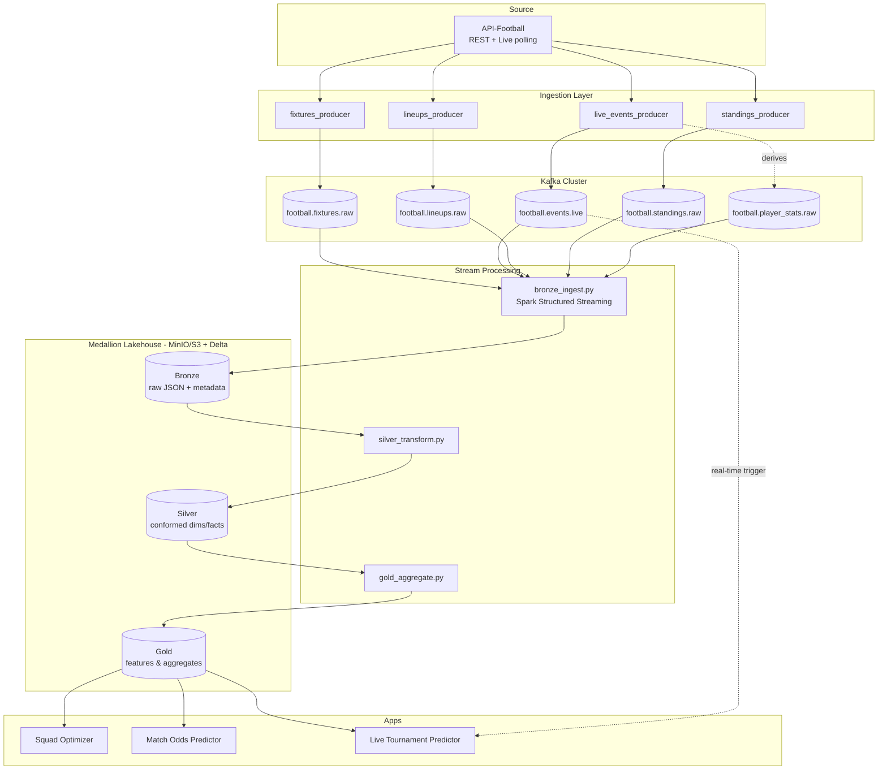

# Architecture

## Overview

## Layer-by-layer

### 1. Ingestion (Kafka producers)

Python producers poll API-Football on a schedule (respecting free-tier rate
limits) and publish raw JSON payloads to Kafka topics, one topic per logical
entity. See [`ingestion/`](../ingestion) and [Kafka topic design](../ingestion/kafka/topics.md).

- **Producer cadence**:
  - Fixtures/lineups/standings: every 15-30 min (low churn)
  - Live events: every 15-60 sec while a tracked fixture is `LIVE`
- **Reliability**: idempotent producer config (`enable.idempotence=true`),
  `acks=all`, retries with backoff. Each message carries a `source_request_id`
  and `ingest_ts` for traceability.

### 2. Stream processing (Spark Structured Streaming)

Three chained streaming/batch jobs, one per medallion hop:

- **`bronze_ingest.py`**: reads from Kafka, writes raw JSON (as strings) +
  Kafka metadata (topic, partition, offset, timestamp) to Bronze Delta tables.
  No transformation — append-only, replayable.
- **`silver_transform.py`**: reads Bronze, parses JSON against explicit
  schemas, deduplicates (by natural key + `ingest_ts`), conforms to dimension
  / fact tables (`dim_team`, `dim_player`, `dim_league`, `fact_match`,
  `fact_match_event`, `fact_player_match_stat`, `fact_standings_snapshot`).
- **`gold_aggregate.py`**: reads Silver, computes rolling-window features
  (team form, ELO ratings, head-to-head records, player season stats) used
  directly by the ML apps.

### 3. Medallion lakehouse

Storage: Delta Lake tables on MinIO (S3-compatible) for local dev — swappable
for real S3/ADLS in a cloud deployment. Table contracts documented in
[`medallion/README.md`](../medallion/README.md).

### 4. Serving / Apps

- **App 1 — Squad Optimizer**: batch-scored from Gold (`player_season_stats`,
  `team_form_features`) + a constraint solver (formation, budget).
- **App 2 — Match Odds Predictor**: classification model trained on Gold
  features (`match_prediction_features`), served via a small API/notebook.
- **App 3 — Live Tournament Predictor**: consumes `football.events.live`
  directly (in addition to Gold features) to re-run a Monte Carlo tournament
  simulation whenever a tracked match result changes.

## Why Spark Structured Streaming over Flink

Flink was considered but de-prioritized in favor of Spark Structured
Streaming — consistent with the broader skills roadmap in this workspace
(`00_master_plan.md`), which already invests heavily in Spark internals/tuning
and treats Flink as comparison/theory content. Structured Streaming's
micro-batch model is a good fit for this data's actual cadence (seconds, not
milliseconds), and keeps the stack to one processing engine. A short
Spark-vs-Flink comparison write-up is planned as one of the Medium articles.

## Local dev environment

`infra/docker-compose.yml` brings up:
- Kafka (KRaft mode, single broker) + Kafka UI
- MinIO (S3-compatible object storage for the lakehouse)

Spark runs locally via `pyspark` (no separate cluster needed for dev-scale
data volumes).
