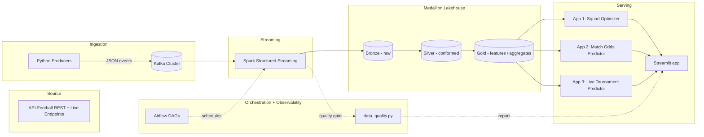

# FIFA / Football Real-Time Stats Pipeline

A hands-on, end-to-end data engineering project: ingest live football data from a
public API via **Kafka**, process it in real time with **Spark Structured
Streaming**, land it in a **Medallion (Bronze/Silver/Gold) lakehouse**, and serve
three AI-powered apps on top of it — via CLI, a **Streamlit** web UI, and
scheduled **Airflow** orchestration.

This repo doubles as a public build-log: weekly LinkedIn updates + Medium
write-ups track progress phase by phase.

**New here?** [`docs/RUNBOOK.md`](docs/RUNBOOK.md) is the single guide to
setting everything up and running every phase end to end.

**Just want to click around?** ▶️ **[Live demo](#)** *(replace this link
with your deployed Streamlit Community Cloud URL — see
[`docs/DEPLOY_STREAMLIT_CLOUD.md`](docs/DEPLOY_STREAMLIT_CLOUD.md))*. No
install, no API key — it runs the Match Odds Predictor, Squad Optimizer, and
Tournament Predictor against a static synthetic snapshot (same ELO/form math
as the real Gold layer); Pipeline Health needs the real pipeline so it's
disabled there. Preview the exact same thing locally with
`FIFA_FORCE_DEMO_MODE=true streamlit run app/streamlit_app.py` — no
Kafka/Spark needed.

## The three apps

| # | App | What it does |
|---|---|---|
| 1 | **Squad Optimizer** | Given a player pool/budget and formation constraints, recommends a starting XI that maximizes predicted win probability for an upcoming match. |
| 2 | **Match Odds Predictor** | Pick two teams -> get win/draw/loss probabilities based on historical form, head-to-head, and ELO ratings. |
| 3 | **Live Tournament Predictor** | Monte Carlo tournament outcome simulation (group-stage qualification odds, knockout bracket win probabilities) that re-runs when a tracked live result comes in. |

See [`docs/apps/`](docs/apps/) for the design of each, and each app's own
`README.md` under `ml/<app>/` for what was actually built (including the
synthetic-data bridges used until enough real fixtures accumulate).

All three are usable from the CLI or from a shared **Streamlit app**
(`app/streamlit_app.py`) — see [Running it](#running-it) below.

## Architecture



Full write-up: [`docs/architecture.md`](docs/architecture.md)

## Repo structure

```
fifa-stats-streaming/
├── docs/                # Architecture, roadmap, runbook, data source notes, app specs
├── infra/               # Local dev stack (Kafka, MinIO, etc.) via docker-compose
├── ingestion/            # Kafka topic config + Python producers (API-Football)
├── streaming/            # Spark Structured Streaming jobs (bronze -> silver -> gold) + data quality
├── medallion/             # Lakehouse table schemas/contracts per layer
├── ml/                    # Feature engineering + models for the 3 apps
├── app/                   # Streamlit web UI over all 3 apps + Pipeline Health
│                          #   (app/demo_data/ backs the public hosted demo)
├── orchestration/         # Airflow DAGs (medallion pipeline, model retraining)
└── notebooks/             # Exploration / EDA notebooks
```

## Tech stack

- **Ingestion**: Python, `confluent-kafka`, API-Football (RapidAPI), with a
  `mock` mode for developing without spending the free-tier daily budget
- **Streaming**: Apache Kafka (KRaft mode), Spark Structured Streaming
- **Storage**: Delta Lake on MinIO (S3-compatible) for local dev, or a plain
  local filesystem path (no Docker/MinIO needed)
- **ML**: scikit-learn (calibrated GBM vs. ELO-only baseline, walk-forward
  backtested) for match odds, PuLP for squad optimization, Monte Carlo
  simulation for tournament predictions
- **Serving**: CLI entrypoints + a Streamlit app sharing a cached Spark
  session and model across pages
- **Orchestration**: Airflow (`medallion_pipeline` @daily,
  `match_odds_model_retrain` @weekly), in its own venv from the Spark/ML
  stack — DAG tasks just shell out to the same scripts you'd run by hand
- **Observability**: `data_quality.py`'s 52 checks (row counts, null rates,
  freshness) across Bronze/Silver/Gold, with a JSON report + Slack-webhook
  alert hook

## Roadmap

See [`docs/roadmap.md`](docs/roadmap.md) for the phased build plan. All 7
phases are complete: ingestion -> streaming -> medallion -> 3 apps ->
orchestration/observability/UI. See [`docs/progress.md`](docs/progress.md)
for the detailed build log and [`docs/retrospective.md`](docs/retrospective.md)
for what worked and what's next.

## Running it

Full instructions (including environment setup): [`docs/RUNBOOK.md`](docs/RUNBOOK.md).
Quickest path to a working demo:

```bash
# 1. Local infra
bash infra/run_local_kafka.sh   # or: cd infra && docker compose up -d
cd ingestion/kafka && ./create_topics.sh --no-docker && cd ../..

# 2. Env vars + a clean lakehouse
export PYTHONPATH=$PWD
export LAKEHOUSE_BASE_PATH="file:///tmp/fifa-lakehouse"
export KAFKA_BOOTSTRAP_SERVERS="localhost:9092"
cp ingestion/config/settings.example.yaml ingestion/config/settings.yaml  # mock: true by default

# 3. Run the pipeline once (mock data)
for p in fixtures standings live_events lineups; do
  python -m ingestion.producers.${p}_producer --once
done
python streaming/jobs/bronze_ingest.py
python streaming/jobs/silver_transform.py
python streaming/jobs/gold_aggregate.py
python streaming/jobs/data_quality.py

# 4. Train App 2's model, then explore everything in the browser
python -m ml.match_odds.src.train
streamlit run app/streamlit_app.py   # http://localhost:8501
```

## Status

✅ All 7 phases complete (ingestion, streaming, medallion, 3 apps,
orchestration/observability/UI). See [`docs/roadmap.md`](docs/roadmap.md).
